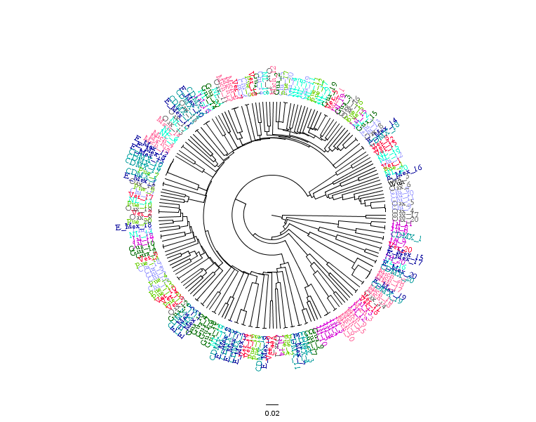
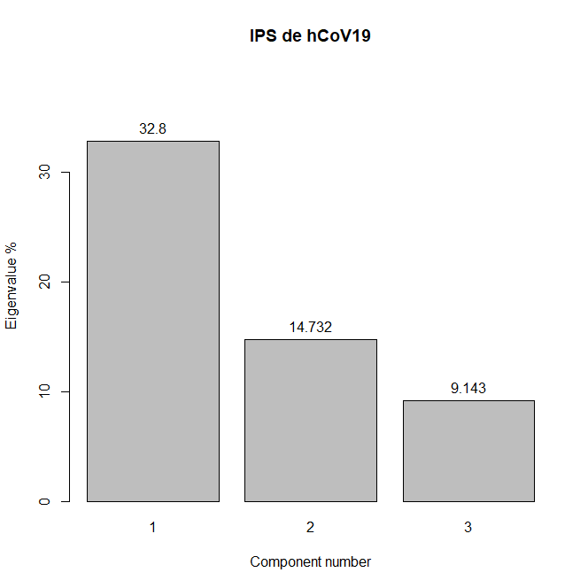
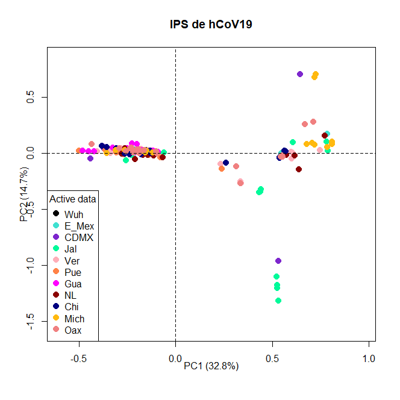
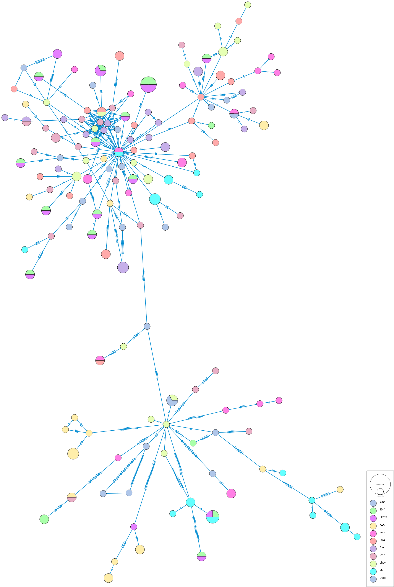
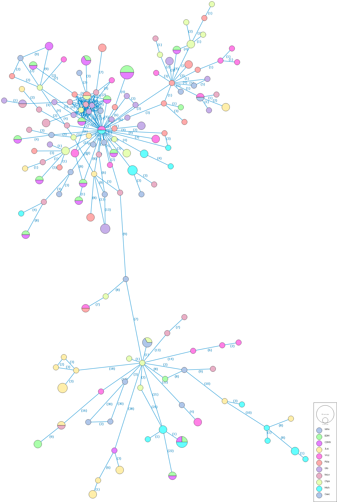

¿Cómo es la evolución de SARS-CoV-2 en los estados más poblados de México?

# Importar secuencias de GISAID

Las secuencias de los genomas de `SARS-CoV-2` fueron recuperadas de la plataforma `GISAID`, 20 secuencias de las 10 entidades federativas más pobladas de México, y del genoma de referencia de Wuhan, contando con un total de 201. Las entidades federativas más pobladas de México son: Estado de México, CDMX, Jalisco, Veracruz, Puebla, Guanajuato, Nuevo León, Chiapas, Michoacan y Oaxaca.


```{r message=FALSE, warning=FALSE}
setwd("C:/Users/52442/Desktop/Proyecto_genomica/") #Directorio en donde se tienen las secuencias
memory.size(max = T) #Optimizar el uso de la 
library(Biostrings)
library(msa)

hCoV19_Mexico <- readDNAStringSet(c("Wuhan_refseq.fasta","1_Estado_de_Mexico.fasta", "2_CDMX.fasta", 
                                    "3_Jalisco.fasta", "4_Veracruz.fasta", "5_Puebla.fasta", 
                                    "6_Guanajuato.fasta", "7_Nuevo_Leon.fasta", "8_Chiapas.fasta", 
                                    "9_Michoacan.fasta", "10_Oaxaca.fasta"))
```


# Alinear secuencias con MAFFT
`MAFFT` (Multiple sequence alignment based on Fast Fourier Transform) es un programa que implementa un algoritmo de alineamiento multiple utilizando FFT (Fast Fourier Transform). 

`MAFFT` se clasifica en tres tipos, (a) un metodo progresivo, (b) método de refinamiento iterativo con el WSP-score y (c), método de refinamiento iterativo con el WSP-score y de consistencias.

_Weighted sum of pairs (WSP-score): add all pairwise alignment scores and contributions form groups of very similar sequences are down.weighted_

Velociad: a > b > c
Precisión: a < b < c

Las regiones homólogas son identificadas por la `FFT`, reduce el tiempo de la CPU e incrementa la precisión de los alineamientos.

Descargar el paquete MAFFT desde Ubuntu
```{bash}
# wget https://mafft.cbrc.jp/alignment/software/mafft_7.480-1_amd64.deb
```

Instalar el paquete
```{bash}
# sudo dpkg -i mafft_7.480-1_amd64.deb  Copy to clipboard 
# [sudo] password for username:  Aquí es donde te debes de recordar de tu contraseña
```

Checar la localización y la versión de `MAFFT`
```{bash}
# which mafft
# /usr/bin/mafft

# mafft --version
# v7.480 (2021/May/21)
```

Una vez que el paquete se haya instalado, entonces podemos utilizar una librería llamada `rMSA` para poder acceder al software recien instalado y realizar el alineamiento múltiple con `MAFFT`.

```{r message=FALSE, warning=FALSE}
# install.packages("remotes")
# remotes::install_github("mhahsler/rMSA", force = T)

library("rMSA")
Mafft_aln <- mafft(x = hCoV19_Mexico)

# save(Mafft_aln, file = "Mafft_aln.RData")
```


# PIS - Parsimony informative sites

PIS son fragmentos o zonas de las secuencias que pueden ser utilizadas para distinguir entre muestras a nivel genetico.

```{r message=FALSE, warning=FALSE}
#install.packages("ips")
load("Mafft_aln.RData")
library(ips)

PI_1 <- as.DNAbin(Mafft_aln)

PI_1_abs <- pis(PI_1, what = "abs", use.ambiguities = FALSE) # Cuantos sitios hay
PI_1_ind <- pis(PI_1, what = "ind", use.ambiguities = FALSE) # En que posiciones del alineamiento


PI_1_abs # Hay 478 sitios informativos
PI_1_ind # Las posiciones
```

```{r message=FALSE, warning=FALSE}
library(ape)
Mafft_aln_nogaps <- deleteGaps(PI_1, gap.max = nrow(PI_1)-4) # Eliminamos todos los gaps

# Comparamos las dimensiones antes y después de remover los gaps
dim(Mafft_aln)
dim(Mafft_aln_nogaps)

PI_2_abs <- pis(Mafft_aln_nogaps, what = "abs", use.ambiguities = FALSE) # Cuantos sitios hay
PI_2_ind <- pis(Mafft_aln_nogaps, what = "ind", use.ambiguities = FALSE) # En que posiciones del alineamiento

PI_2_abs # Hay 478 sitios informativos
PI_2_ind # Las posiciones


PI_hCoV19 <- Mafft_aln_nogaps[ , c(PI_2_ind)] # Seleccionamos del alineamiento solamente los sitios informativos
```


```{r message=FALSE, warning=FALSE}
# Asignamos nombres a las secuencias que ahora tenemos
Estados <- c("Wuh", paste0("E_Mex_", seq("1", "20")), paste0("CDMX_", seq("1", "20")), 
             paste0("Jal_", seq("1", "20")), paste0("Ver_", seq("1", "20")), 
             paste0("Pue_", seq("1", "20")), paste0("Gua_", seq("1", "20")), 
             paste0("NL_", seq("1", "20")), paste0("Chi_", seq("1", "20")), 
             paste0("Mich_", seq("1", "20")), paste0("Oax_", seq("1", "20")))

rownames(PI_hCoV19) <- Estados

# write.nexus.data(PI_hCoV19, file = "PI_hCoV19.nex")
# write.FASTA(PI_hCoV19, file = "PI_hCoV19.fa")
```


# Análisis de cluster

Con el archivo `FASTA` previamente creado de los `IPS` se realizó una matriz de distancias
```{r message=FALSE, warning=FALSE}
library(seqinr)
library(msa)

PI_hCoV19 <- readDNAMultipleAlignment("PI_hCoV19.fa")

PI_hCoV19 <- msaConvert(PI_hCoV19, type="seqinr::alignment")

D <- dist.alignment(PI_hCoV19, "similarity")
```

Posteriormente, se hizó un análisis de cluster para observar de manera gráfica como las secuencias se agrupan
```{r message=FALSE, warning=FALSE}
Dendograma <- hclust(D, "average")
plot(Dendograma)

Dendo <- as.phylo(Dendograma)
# write.tree(phy = Dendo, file="Dendo.newick")
```

El dendograma creado es exportado para mejorar su visualización en `Figtree`
```{r message=FALSE, warning=FALSE}
# install.packages("png")
library(png)

```


# MDS

`MDS` es una técnica de reducción de la dimensionalidad para proyectar en dos dimensiones las distancias relativas de, en este caso, las secuencias de los 10 estados de México.

```{r message=FALSE, warning=FALSE}
# install.packages("bios2mds")
library(bios2mds)

PI_hCoV19 <- import.fasta("PI_hCoV19.fa") # Importar las secuencias de los PIS

# Se crea una base de datos donde se tenga informacion acerca de que secuencia pertenece a que grupo (estado) y el color que se le será asignado para visualizarlos en el plot.

Estados <- c("Wuh", paste0("E_Mex_", seq("1", "20")), paste0("CDMX_", seq("1", "20")), 
             paste0("Jal_", seq("1", "20")), paste0("Ver_", seq("1", "20")), 
             paste0("Pue_", seq("1", "20")), paste0("Gua_", seq("1", "20")), 
             paste0("NL_", seq("1", "20")), paste0("Chi_", seq("1", "20")), 
             paste0("Mich_", seq("1", "20")), paste0("Oax_", seq("1", "20")))

Nombres <- Estados

Estados <- c("Wuh", rep("E_Mex", 20), rep("CDMX", 20), 
             rep("Jal", 20), rep("Ver", 20), rep("Pue", 20), 
             rep("Gua", 20), rep("NL", 20), rep("Chi", 20), 
             rep("Mich", 20), rep("Oax", 20))

Colores <- c("blue", rep("turquoise", 20), rep("purple3", 20), 
             rep("mediumspringgreen", 20), rep("lightpink1", 20), rep("sienna1", 20), 
             rep("magenta", 20), rep("darkred", 20), rep("navyblue", 20), 
             rep("darkgoldenrod1", 20), rep("lightcoral", 20))

# Agregamos comillas a todos los elementos que se encuentran een los objetos
Nombres <- sapply(Nombres, function(x) gsub("\"", "", x))
Estados <- sapply(Estados, function(x) gsub("\"", "", x))
Colores <- sapply(Colores, function(x) gsub("\"", "", x))


Grupos <- cbind(Nombres, Estados, Colores)
Grupos <- Grupos[ ,-1] # Quitamos una columna extra
# write.csv(Grupos, file = "Grupos.csv")
```

Con el archivo `csv` creado, de manera manual se quitó el primer renglon y se importó para realizar el `MDS`

```{r message=FALSE, warning=FALSE}
Dist_mat <- mat.dif(PI_hCoV19, PI_hCoV19)
mmds_hCoV19 <- mmds(Dist_mat, group.file = "C:/Users/52442/Desktop/Proyecto_genomica/Grupos.csv")

scree.plot(mmds_hCoV19$eigen.perc, lab = TRUE, title = "PIS de hCoV19")

```

Este es un plot de los tres componentes principales que explican el mayor porcentaje de la variación. El primer componente explica eñ 32.8%, el segundo componente el 14.732% y el tercero el 9.143%.

```{r message=FALSE, warning=FALSE}
mmds.2D.plot(mmds_hCoV19, title = "IPS de hCoV19")

```

Se hizo una representación con los dos primeros componentes principales, los cuales juntos explican un 47.5% de la variación.

```{r message=FALSE, warning=FALSE}
mmds.3D.plot(mmds_hCoV19, title = "IPS de hCoV19")
```

Tambien se pueden tomar en cuenta el tercer componente principal para hacer un plot de tres dimensiones

# Redes

Se exportó un archivo nexus con el alineamiento de las secuencias, a este archivo se añadieron etiquetas de los lugares donde se obtuvieron las secuencias, para así poder generar una red en la que los nodos pudieran ser distinguidos entre si por el color que se les asignó con base en el estado donde se obtuvieron.

Dicha red muestra nodos que contienen un determinado numero de secuencias, el tamaño de los nodos es proporcional al numero de secuencias que contiene, lo que sugiere que tales secuencias son, en esencia, idénticas y las conexiones entre cada par de nodos muestra los cambios o mutaciones de nucleótidos que hay entre estos nodos; es decir, si el vértice que une a dos nodos presenta un valor de 3, significa que esas dos secuencias difieren en tres nucleótidos.

```{r message=FALSE, warning=FALSE}

```

Tajima's D es un estadístico de genética poblacional que se calcula a partir de secuencias nucleotidicas. Se usa comúnmente para estimar si ciertos supuestos se cumplen en una población o conjunto de secuencias. Uno de estos supuestos es el de Evolución neutral, que indica si existe o no una significancia evolutiva en las secuencias que se trabajan.

D=-2.22035

Un valor negativo del estadístico Tajima's D sugiere que existe significancia de los PIS en la evolución de estos genomas.

```{r message=FALSE, warning=FALSE}

```


```{r message=FALSE, warning=FALSE}
library(igraph)
Ady_list <- read.table("FinalytalTABLE.txt")[ ,c(-2)]
Ady_list <- as.matrix(Ady_list)

colnames(Ady_list) <- c("V1", "V2")


Red_popart <- graph_from_edgelist(Ady_list, directed = F)
layout <- layout.fruchterman.reingold(Red_popart)
plot(Red_popart, layout = layout, vertex.size = 4,
     vertex.label = NA, edge.arrow.size = .1, vertex.color="gray50")

plot(degree.distribution(Red_popart))

eb <- edge.betweenness.community(Red_popart)
lb <- label.propagation.community(Red_popart)
cs <- cluster_spinglass(Red_popart)

plot(eb, Red_popart, layout = layout, vertex.size = 4,
     vertex.label = NA, edge.arrow.size = .1, vertex.color="gray50")

plot(lb, Red_popart, layout = layout, vertex.size = 4,
     vertex.label = NA, edge.arrow.size = .1, vertex.color="gray50")

plot(cs, Red_popart, layout = layout, vertex.size = 4,
     vertex.label = NA, edge.arrow.size = .1, vertex.color="gray50")


```


# Conclusiones

Este es un análisis que puede brindar infomación acerca de como una variante podría estar distribuída en una población (implica analizar más secuencias)

Los resultados obtenidos con este análisis pueden ayudar a entender como es que las variantes virales se propagan, ademas, este tipo de redes geo-filogenéticas puede ser útil para observar la evolución viral en un sitio determinado.

# Session info {.unnumbered}

```{r sessionInfo, echo=FALSE}
sessionInfo()
```
